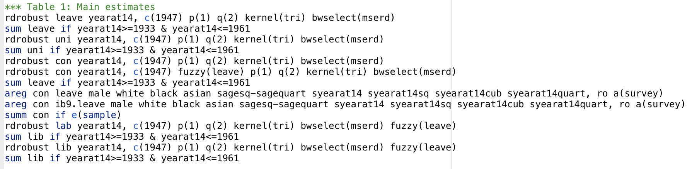

```{r setup, include=FALSE}
knitr::opts_chunk$set(echo = FALSE)

library(rdrobust)
library(gt)
library(sjPlot)
library(tidyverse)

load("raw-data/UK Election Data Replication.RData")

```

## Grapic 
Below is a beautiful graphic which uses the data from Marshall 2015 and is based on Figure 3 in the paper. I used inspiration/guidance from [@king] to create it. 
 
```{r data for graphic}

# first select only the relevant columns and years 
# years 1925-1970 were used by Marshall in figure 3
# year at 14 gives the cohort year, and con is the column
# where 1 indicates voting conservative, and 0 is not

x <- table %>%
  select(yearat14, con) %>%
  filter(yearat14 >= 1925 & yearat14 <= 1970)

# in order to calculate the percentage of votes that were
# conservative each year I made two tables

# first I simply calculated the total number of individuals
# that were surveyed each year

num_per_year <- x %>%
  group_by(yearat14) %>%
  count()

# then I coundted the number of conservative votes in
# that year 

num_con_per_year <- x %>%
  group_by(yearat14) %>%
  count(con) %>%
  filter(con == 1)

# then I used left join to combine these two tables by year
# I replaced instances were the con or n.y (which was number
# of conservative votes that were 1) column was NA with 0 
# in order to include those instances in our calculations
# then I created a proportion column by dividing n.y (number
# of conservative votes) by n.x (number of voters per year)
# for each year

# I also split the table into two groups by creating a 
# group column. The groups were created by splitting the
# data about the year 1947, as was done in Figure 3 of 
# Marshall 2015, in order to see how voting conservative 
# changed after that year. 

con_props <- left_join(num_per_year, num_con_per_year, by = "yearat14") %>%
  replace_na(list(con = 0, n.y = 0)) %>%
  summarize(con_prop = n.y/n.x) %>%
  
  # 1925-1947 is 23 years and 1947-1970 is 23 years
  
  mutate(group = c(rep("1", 23), rep("2", 23)))

```

```{r graphic}

# here the graphic is created from the con_props data
# with yearat14 as the x axis and proportion that voted
# conservative as the y axis. The points were colored
# by their group (which side of 1947 they were on)

ggplot(con_props, aes(x = yearat14, y = con_prop, color = group)) + 
  geom_point() +
  
  # I added a geom_vline at 1947 so the year would be 
  # more obvious when looking at the graph
  
  geom_vline(xintercept = 1947) + 
  
  # I added best fit lines to each side of 1947
  # method was set to loess  to get a polynomial
  # fit for each group as was done in Figure 3 of
  # Marshall 2015
  
  geom_smooth(se = FALSE, method = "loess") +
  
  # titles, labels, and caption was then added
  
  labs(title = "Proportion of Cohorts Voting Conservative Before and After 1947",
       subtitle = "Modeled after Figure 3 from Marshall 2015",
       x = "Cohort (year at age 14)",
       y = "Proportion of Cohort Voting Conservative",
       caption = "Figure 1: This figure illustrates the jump in proportion of a cohort, or class, of British individuals (classified by the year at \nwhich they were 14), after the education reform in 1947 which increased the year at which you could legally leave high \nschool from 14 to 15.") +
  
  # remove legend and right align caption
  
  theme(legend.position = "none",
        plot.caption = element_text(hjust = 0))

```


## Overview of Replication Paper

This paper by John Marshall uses data from the results of the 1947 high school leaving age reform in Great Britain, to analyze how additional years in high school affect political preferences [@main]. This paper looked specifically in how additional years in high school effected voting for the Conservative Party [@main]. In 1947, Great Britain changed the high school leaving age from 14 to 15, this induced almost half the student population to stay in school for at least 1 or 2 more years [@main]. Data from the 10 British elections between 1947 and 2010 was then used to compare voters young enough to have been effected by the reform to those who were too old to have been effected, using regression discontinuity [@main]. Regression discontinuity is usually used for determining if a program/treatment is effective, and essentially is is a pretest-posttest program-comparison group design strategy [@regression-discont]. Regression discontinuity is unique in that individuals are assigned to one of two groups, just based on if they are on either side of a pre-determined cut-off [@regression-discont].The results of data analysis revealed staying in high school for longer substantially increased likelihood to vote for the Conservative Party (staying one extra year increased probailitiy of voting Conservative by almost 12 percentage points) [@main]. This supports the previously studied fact that high school is extremely pertinent to political opinions later in life [@main]. In addition, this significant finding indicates the education reform of 1947 may have had an even greater affect on politics and election results nationwide over many years than ever expected [@main]. 

All analysis for this paper is available in my github repo.^[[Link to Github Repo](https://github.com/mollyechiang/1006_milestone_5)].


## Extension

500 words about your proposed extension. You do not have to have done the extension yet. (That comes next week.) But it is time to start thinking about what your contribution to human knowledge will be. You seek admission to the School of Athens. What do you have to offer us?


## Replication Process

I was able to replicate nearly all of the figures in the paper in stata. The code I ran and the output figures are included in the appendix. In terms of the tables, I was able to run all of the code in stata almost directly from Marshall's replication code (some aspects I had to change because some of the functions he used have been updated since he wrote the paper). However, I had a lot of trouble going from the raw results of the models Marshall ran to the polished tables I saw in his paper, as only code for the models were included in his .do file. Thus, I have included screenshots of the raw code and the relevant aspects of the output that would be included in the table in the paper. I hope to learn more basics of stata in order to compile and nicely display these raw outputs from Marshall's code.

For brevity, I did only included the screenshots from tables 1 and 2 and not table 3 (as it would be a lot of seperate screenshots to include), but I have included the table 3 code, which was run in the same way. Table 4 was not able to be replicated as there was no code for table 4 included in Marshall's replication code.

Most coefficients exactly or almost exactly matched Marshall's published results. A few were a few decimal places off (potentially due to different iterations of the regression), and a even fewer were quite different, which still needs to be investigated.

This paper relies heavily on rdrobust models, and the reference material for learning about this function and its package is from [@rdrobust].

## Appendix
\


\


\


 




\newpage 

## References

Reference material to create this bibliography comes from [@bib]


